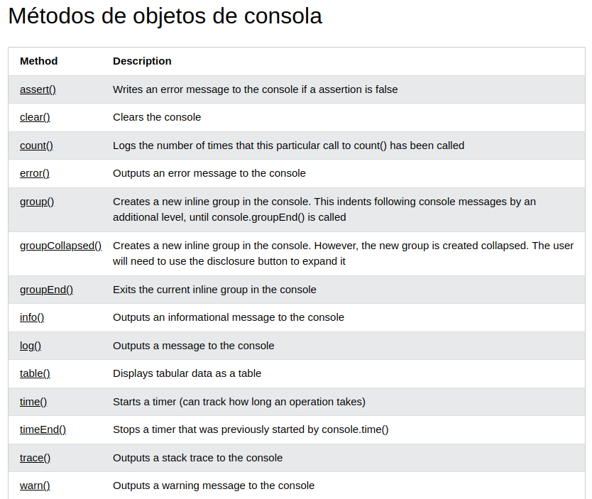
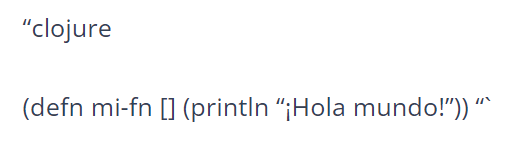
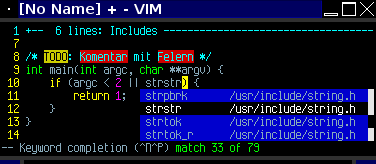
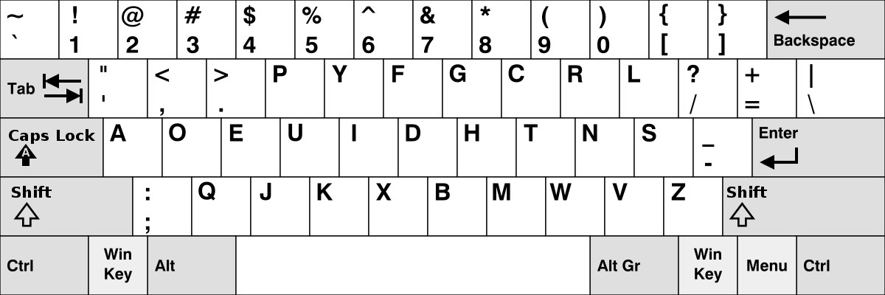
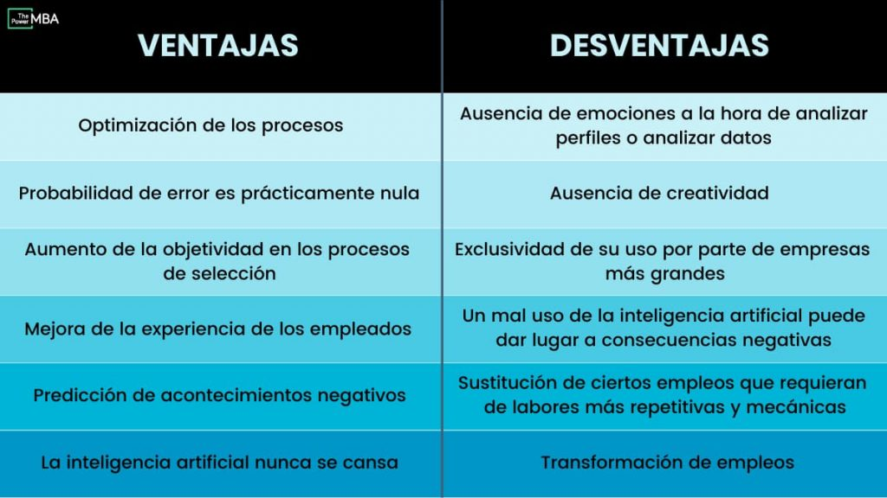

# Tarea viernes lógica 7 de julio

## teórica

1. Qué es `MongoDB` en `Web Development` y para qué sirve?, de ejemplos.
MongoDB es un sistema de base de datos NoSQL orientado a documentos de código abierto y escrito en C++, que en lugar de guardar los datos en tablas lo hace en estructuras de datos BSON (similar a JSON) con un esquema dinámico. Ejemplo:
 

3. Qué es `NoSQL` en `Web Development` y para qué sirve?, de ejemplos.
NoSQL se refiere a una base de datos no relacional o no SQL. Una base de datos relacional es un formato de bases de datos muy estructurado basado en una tabla, como MySQL u Oracle. Las bases de datos NoSQL están orientadas a los documentos y le permiten almacenar y recuperar datos en formatos que no sean tablas. Algunas de las plataformas NoSQL más conocidas son MongoDB, Elasticsearch® y Redis®.

4. Qué es `Website wireframed` en `Web Development` y para qué sirve?, de ejemplos.
Un wireframe es un diagrama visual que esboza el esqueleto de un proyecto o pieza tecnológica. A veces se conoce como esquema de la página o plano de la pantalla y muestra cómo se relacionan los elementos entre sí y cómo están estructurados. . Sirve para definir de forma sencilla y esquemática el contenido y la posición de los distintos bloques del sitio web. 

5. Qué es `Perl`, para que se usa y de ejemplos de su `codificación`?
Perl es un acrónimo de Practical Extracting and Reporting Languaje, que viene a indicar que se trata de un lenguaje de programación muy práctico para extraer información de archivos de texto y generar informes a partir del contendido de los ficheros. 

6. Qué es `PHP`, para que se usa y de ejemplos de su `codificación`?
PHP es un lenguaje de programación destinado a desarrollar aplicaciones para la web y crear páginas web, favoreciendo la conexión entre los servidores y la interfaz de usuario.

Entre los factores que hicieron que PHP se volviera tan popular, se destaca el hecho de que es de código abierto.

6. Qué es `ASP`, para que se usa y de ejemplos de su `codificación`?
ASP (Active Server Pages) es la tecnología desarrollada por Microsoft para la creación de páginas dinámicas del servidor. ASP se escribe en la misma página web, utilizando el lenguaje Visual Basic Script o Jscript (Javascript de Microsoft).

7. Qué es `blog` en `Web Development` y para qué sirve?, de ejemplos.
Es un sitio web personal donde uno puede publicar cualquier cosa que desee compartir con otros. Se trata de un sitio Web, que se actualiza periódicamente y que recopila cronológicamente textos y artículos de uno o varios autore  ejemplo": El blog de playstation 

 8.Qué es .Net, para que se usa y de ejemplos de su codificación? 
.NET es una plataforma de aplicaciones que permite la creación y ejecución de servicios web y aplicaciones de Internet. En la plataforma de desarrollo se pueden utilizar una serie de lenguajes, implementaciones, herramientas y bibliotecas para el desarrollo de las aplicaciones.

En definitiva, es hoy en día la plataforma de desarrollo de software más usada para nuevos proyectos de desarrollo de software además de Java.

9. Qué es `Web 2.0` y para qué sirve?, de ejemplos.
El término Web 2.0 se utiliza para referirse a una nueva generación de sitios web que permiten a las personas colaborar y compartir información en línea de formas que antes no eran posibles. Este tipo de sitios web suelen considerarse interactivos, colaborativos o con contenidos generados por los usuarios. Sitios web como Facebook, Twitter, YouTube y Wikipedia son ejemplos de la web 20.

10. Qué es `Bootstrap`, para que se usa y de ejemplos de su `codificación`?

11. Qué es `AngularJS`, para que se usa y de ejemplos de su `codificación`?
Bootstrap es un framework CSS utilizado en aplicaciones front-end — es decir, en la pantalla de interfaz con el usuario— para desarrollar aplicaciones que se adaptan a cualquier dispositivo. 

12. Qué es `ReactJs`, para que se usa y de ejemplos de su `codificación`?
ReactJS es una librería robusta de JavaScript utilizada en el desarrollo de aplicaciones web dinámicas. Hace que la codificación de JavaScript sea más sencilla, mejora el rendimiento y el SEO de tu aplicación, entre otras ventajas. 

13. Qué es `EmberJS`, para que se usa y de ejemplos de su `codificación`?
EmberJS y su marco de aplicación. Se trata de un framework front-end orientado al desarrollo de proyectos de modo ágil y productivo y que puedan ser mantenidos a largo plazo como por ejemplo aplicaciones web o móviles.

14. Qué es `Ruby`, para que se usa y de ejemplos de su `codificación`?
Ruby es Un lenguaje de programación dinámico y de código abierto enfocado en la simplicidad y productividad. Su elegante sintaxis se siente natural al leerla y fácil al escribirla.

15. Qué es `Python`, para que se usa y de ejemplos de su `codificación`?
Python es un lenguaje de programación ampliamente utilizado en las aplicaciones web, el desarrollo de software, la ciencia de datos y el machine learning (ML).Sirve desde programación de instrumentos hasta software de computadoras, desarrollo web y aplicaciones móviles.

16. Qué es `jQuery`, para que se usa y de ejemplos de su `codificación`?
jQuery es una biblioteca de JavaScript que se utiliza para simplificar la creación de páginas web dinámicas e interactivas

17. Qué es `LESS`, para que se usa y de ejemplos de su `codificación`?
LESS es un dinámico lenguaje de hojas de estilo que puede ser compilado en hojas de estilo en cascada (CSS) , pero a diferencia de estás funciona como un lenguaje de programación, permitiendo el uso de variables, funciones, operaciones aritméticas, entre otras, para acelerar y enriquecer los estilos en un sitio web.

18. Qué es `SASS`, para que se usa y de ejemplos de su `codificación`?
SASS es un preprocesador de CSS compatible con todas sus versiones. Por lo tanto, se trata de una herramienta utilizada por los desarrolladores web para traducir un código de hojas de estilo no estándar a un código CSS estándar, legible por la mayoría de los navegadores. La principal utilidad de SASS es la de hacer más simple la escritura del código CSS, además de brindar diversas utilidades que a día de hoy el CSS no puede ofrecer.

19. Qué es `Ajax`, para que se usa y de ejemplos de su `codificación`?
AJAX significa JavaScript asíncrono y XML (Asynchronous JavaScript and XML). Es un conjunto de técnicas de desarrollo web que permiten que las aplicaciones web funcionen de forma asíncrona, procesando cualquier solicitud al servidor en segundo plano

20. Qué es `Java`, para que se usa y de ejemplos de su `codificación`?
Java es un lenguaje de programación utilizado para crear software compatible con una gran diversidad de sistemas operativos. Este lenguaje tiene la particularidad de ser compilado e interpretado al mismo tiempo; esto significa que es un lenguaje simplificado que convierte automáticamente el código en instrucciones de máquina.

## Práctica

1. Realice el ejercicio `Diagonal Difference` del portal `HackerRank`.
2. Realice los ejercicios del `1` al `69` de `Responsive Web Design`, del apartado `Learn HTML by Building a Cat Photo App` del portal `freeCodeCamp`.
3. En el apartado práctica crear un archivo llamado `practica_4.c` donde debera hallar la solución al siguiente enunciado:
  2.2. `4. Hacer una función ordene números enteros de un arreglo de forma ascendente.`
4. En el apartado práctica crear un archivo llamado `practica_5.c` donde debera hallar la solución al siguiente enunciado:
  4.2. `5. Hacer una función que imprima los primeros n números primos.`
