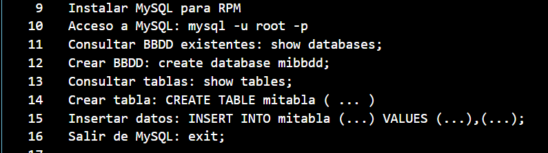
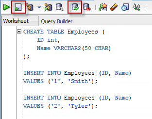
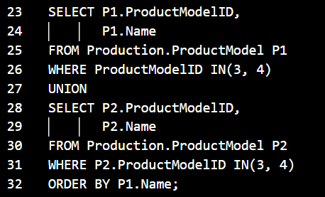
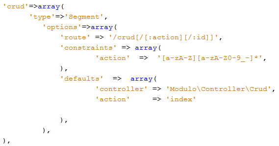
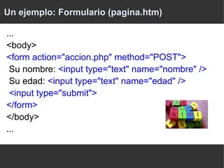
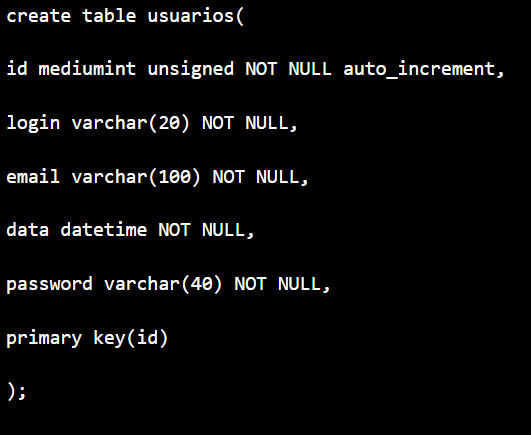
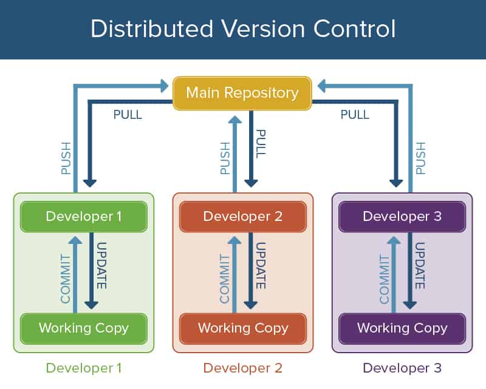
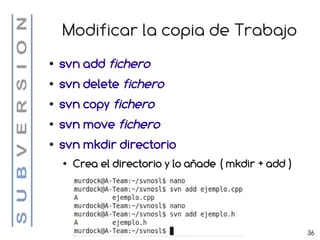
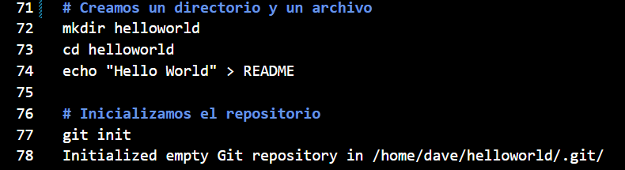
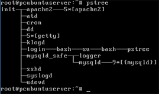

# Tarea lunes HTML5 10 de julio

## teórica

1. Qué es `MySQL` en `Web Development` y para qué sirve?, de ejemplos.

MySQL es un sistema de bases de datos de Oracle que se utiliza en todo el mundo para gestionar bases de datos. Se basa en el álgebra relacional y se utiliza principalmente para el almacenamiento de datos de diversos servicios web 

2. Qué es `Oracle` en `Web Development` y para qué sirve?, de ejemplos.

Oracle Fusion Middleware es una plataforma de negocios digital que conecta a las organizaciones con la nube. Permite a las empresas crear y ejecutar aplicaciones empresariales ágiles e inteligentes, mientras maximiza la eficiencia informática con arquitecturas de hardware y software modernas y completas.

3. Qué es `SQL Server` en `Web Development` y para qué sirve?, de ejemplos.

Microsoft SQL Server es uno de los principales sistemas de gestión de bases de datos relacional del mercado que presta servicio a un amplio abanico de aplicaciones de software destinadas a la inteligencia empresarial y análisis sobre entornos corporativos. Sirve  para almacenar toda la información deseada en bases de datos relacionales, como también para administrar dichos datos sin complicaciones, gracias a su interfaz visual y a las opciones y herramientas

4. Qué es `framework` en `Web Development` y para qué sirve?, de ejemplos.

Un framework es un esquema o marco de trabajo que ofrece una estructura base para elaborar un proyecto con objetivos específicos, una especie de plantilla que sirve como punto de partida para la organización y desarrollo de software.Sirve para  acelerar el trabajo y favorecer que este sea colaborativo, reducir errores y obtener un resultado de más calidad. Ejemplo: .Net, Zend Framework, Laravel.

5. Qué es `Zend`, para que se usa y de ejemplos de su `codificación`?

 Zend Framework (ZF) es un framework de código abierto para desarrollar aplicaciones web y servicios web con PHP5. ZF es una implementación que usa código 100% orientado a objetos. La estructura de los componentes de ZF es algo único; cada componente está construido con una baja dependencia de otros componentes. EJEMPLO:

6. Qué es `Symfony`, para que se usa y de ejemplos de su `codificación`?

Symfony es un framework diseñado para desarrollar aplicaciones web basado en el patrón Modelo Vista Controlador. Para empezar, separa la lógica de negocio, la lógica de servidor y la presentación de la aplicación web. Ejemplo:

7. Qué es `CakePHP`, para que se usa y de ejemplos de su `codificación`?

CakePHP es un marco de desarrollo [framework] rápido para PHP, libre, de código abierto. Se trata de una estructura que sirve de base a los programadores para que éstos puedan crear aplicaciones Web. 

8. Qué es `version control software` en `Web Development` y para qué sirve?, de ejemplos.

El control de versiones, también conocido como gestión de código fuente, utiliza herramientas para realizar un seguimiento de las modificaciones o los cambios realizados en el código fuente a lo largo del tiempo.

9. Qué es `SVN`, para que se usa y de ejemplos de su `codificación`?
SVN permite al usuario crear, copiar y borrar carpetas con la misma flexibilidad con la que lo haría si estuviese en su disco duro local.  

10. Qué es `CVS`, para que se usa y de ejemplos de su `codificación`?

CVS es un Sistema Concurrente de Versiones, una forma de trabajo habitualmente utilizada para almacenar el código fuente de grandes proyectos de software. CVS almacena todas las versiones de todos los ficheros de tal forma que nada puede perderse, y su utilización por varias personas es registrada. 

11. Qué es `Git`, para que se usa y de ejemplos de su `codificación`?

 Git es un sistema de control de versiones distribuido, lo que significa que un clon local del proyecto es un repositorio de control de versiones completo. Estos repositorios locales plenamente funcionales permiten trabajar sin conexión o de forma remota con facilidad.

12. Qué es `Linux` en `Web Development` y para qué sirve?, de ejemplos.

Linux es un sistema operativo open source gratuito que se lanza en virtud de la Licencia Pública General de GNU (GPL). Cualquier persona puede ejecutar, estudiar, modificar o redistribuir el código fuente, e incluso comercializar las copias de su código modificado, siempre y cuando lo haga con la misma licencia.

13. Qué es una `public APIs` y una `private APIs`, para que se usan, de ejemplos y diga en qué se diferencian?

Public APIs: Tambien conocidas como externas o publicas, las API abiertas tienen medidas de seguridad relajadas, lo que permite a los desarrolladores y usuarios externos acceder a los datos facilmente. Algunos sistemas permanecen completamente transparentes, mientras que otros pueden requerir un registro simple o clave API. Ejemplo API de Marvel , Pokemon, Covid Tracking

Una API privada es una interfaz de programación de aplicaciones que tiene su aplicación alojada con desarrolladores internos. Las API privadas actúan como interfaces frontales para respaldar los datos y las funciones de la aplicación. La interfaz proporciona un punto de entrada para desarrolladores o contratistas que están trabajando para desarrollar esas funciones.Ejemplo: API privada de Amazon API Gateway

14. Vea el video de [Las Matemáticas tienen una Terrible Falla](https://youtu.be/RRg38oNQ9vk) del canal [Veritasium en español](https://www.youtube.com/@VeritasiumES), y diga qué opina del video y las implicaciones históricas que han tenido las matemáticas en las ciencias de la computación.

15. Lea el artículo llamado [3 Web Dev Careers Decoded: Front-End vs Back-End vs Full Stack](https://www.udacity.com/blog/2020/12/front-end-vs-back-end-vs-full-stack-web-developers.html), y comente en clases qué le ha parecido el papel que cumplen las tres carreras de desarrollo web.

16. Lea el artículo del [Facebook’s engineering department](https://www.facebook.com/notes/10158791462547200/), y comente en clases qué le ha parecido el artículo que popularizó el término Full stack developer en el año 2010.

## Práctica

1. Realice el ejercicio `Plus Minus` del portal `HackerRank`.