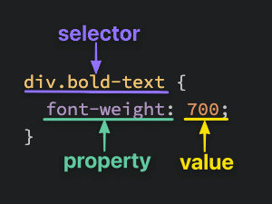
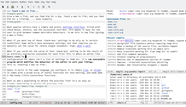
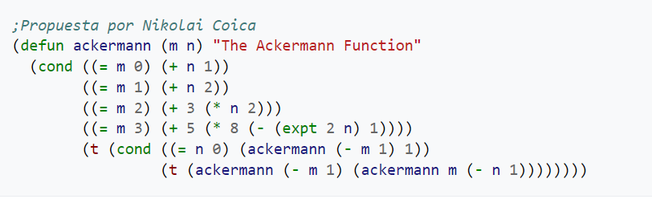

# Tarea lunes HTML5 13 de julio

## teórica

1. Qué es `Scala`, para que se usa y de ejemplos de su `codificación`?

 Scala es un lenguaje de programación de propósito general, diseñado para el desarrollo utilizando patrones de una forma concisa, elegante y con tipos. Es de código abierto, integra principios de orientación a objetos y la programación funcional, permitiendo a los programadores ser más productivos y aprovechar los conocimientos y estructuras de otros lenguajes como Java.
 

2. Qué es `Go`, para que se usa y de ejemplos de su `codificación`?

Go (o Golang) es un lenguaje de programación de código abierto. Desarrollado y presentado por Google en 2009, tiene como finalidad la de crear servicios de red activa con una buena optimización y eficacia, es de codigo abierto.

3. Qué es `Clojure`, para que se usa y de ejemplos de su `codificación`?

Clojure es un lenguaje de programación funcional. Es uno de los lenguajes más populares para construir aplicaciones en la JVM (Máquina Virtual Java) porque ofrece una sintaxis simple y elegante que facilita la escritura de código.

4. Qué es `Emacs` en `Web Development` y para qué sirve?, de ejemplos.

Emacs es un editor para uso en todo tipo de situaciones en las que debamos editar texto plano. Es un editor de código clásico de GNU, la organización que se encarga de dar soporte al Kernel de Linux con todo un ecosistema de software libre para completar el sistema operativo.

5. Qué es `Vim`, en `web development` y para qué sirve?, de ejemplos.

Vim (del inglés Vi IMproved) es una versión mejorada del editor de texto Vi, presente en todos los sistemas UNIX.
La principal característica tanto de Vim como de Vi consiste en que disponen de diferentes modos entre los que se alterna para realizar ciertas operaciones, lo que los diferencia de la mayoría de editores comunes, que tienen un solo modo en el que se introducen las órdenes mediante combinaciones de teclas o interfaces gráficas.

6. Qué es `Dvorak`, en `web development` y para qué sirve?, de ejemplos.

El teclado Dvorak es un diseño de teclado ergonómico. Está diseñado para aumentar la velocidad de escritura en comparación con el diseño del teclado QWERTY. 

7. Qué es `Ruby on Rails`, para que se usa y de ejemplos de su `codificación`?

Ruby on Rails es un framework o marco de creación de aplicaciones de código abierto, que funciona con Ruby. Se trata de un conjunto de bibliotecas que posibilitan el desarrollo de aplicaciones web usando Ruby, ya que está escrito en este mismo lenguaje.

rails db:migrate

8. Qué es `Lisp`, para que se usa y de ejemplos de su `codificación`?

Lisp (históricamente LISP) es una familia de lenguajes de programación de computadora de tipo multiparadigma con larga historia y una inconfundible y útil sintaxis homoicónica basada en la notación polaca.

9. Lea el artículo llamado [Why Learning to Code is So Damn Hard By Erik Trautman](https://www.thinkful.com/blog/why-learning-to-code-is-so-damn-hard/), y comente en clases qué opina de la lectura y su propia evolución como programador.

10. Vea el video de [Learn to Code: 4 Ways to Learn to Code Fast | Thinkful](https://youtu.be/xv_viTuyrHw) del canal [Thinkful](https://m.youtube.com/@Thinkful), y diga qué opina usted acerca de las estrategias dadas por los expertos acerca de como aprender a codificar rápidamente.

## Práctica

1. Realice el ejercicio `Mini-Max Sum` del portal `HackerRank`.

2. Tómate una foto profesional en fondo blanco, vestido de manera formal y sonriendo a la camara sin crusar los brazos, en formato cuadrado y de buena calidad, y luego usala como foto de perfil de tu cuenta de usuario en el portal [LinkedIn](https://www.linkedin.com/) una vez aprobada usa esta foto de perfil para tus demás cuentas profesionales de tus cuentas asociadas a las redes profesionales de programación, como Github, stack overflow, etc.