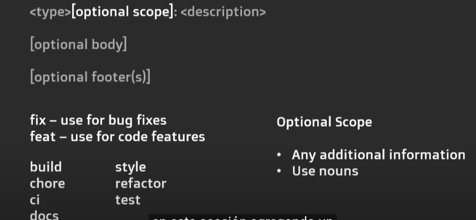

# Tarea Jueves HTML5 17 de agosto

## teórica

1. Lea el artículo [Commit Messages](https://www.theodinproject.com/lessons/foundations-commit-messages) y diga en clases que conclusiones puede tener del artículo.

COmo escribir un mensaje de commit significativo
Por que es importante tener mensajes con una buena descripcion
Cuando hacer commit

2. Lea el artículo [Are commit messages so important they deserve their own lesson?](https://www.theodinproject.com/lessons/foundations-commit-messages#are-commit-messages-so-important-they-deserve-their-own-lesson) y diga en clases que conclusiones puede tener del artículo.

Es importante tener un buen commit ya que:
-Al buscar empleo los reclutadores veran nuestro historial de commit
-Al tener un mensaje significativo, podras ver que cambios haz hecho a lo largo del tiempo
-Ademas te ayudara a recordar el ultimo paso que diste en tu projecto

3. Lea el artículo [Bad vs. good commits](https://www.theodinproject.com/lessons/foundations-commit-messages#bad-vs-good-commits) y diga en clases que conclusiones puede tener del artículo.

como hacer un buen commit 
-Ya que puedes hacer un commit con 72 caracteres, tienes que ser especifico en el ultimo paso que hiciste, algo especifico que puedas identificar claramente en donde te quedaste

4. Lea el artículo [When to commit](https://www.theodinproject.com/lessons/foundations-commit-messages#when-to-commit) y diga en clases que conclusiones puede tener del artículo.

Puedes hacer commit cada vez que estes en un punto muy importante del projecto, para guardar el registro de cada una

5. Lea el artículo [How to Write a Git Commit Message](https://cbea.ms/git-commit/) y diga en clases que conclusiones puede tener del artículo.

-Separe el asunto del cuerpo con una línea en blanco
-Limite la línea de asunto a 50 caracteres
-Poner en mayúscula la línea de asunto
-No termine la línea de asunto con un punto
-Use el estado de ánimo imperativo en la línea de asunto
-Envuelva el cuerpo en 72 caracteres
-Usa el cuerpo para explicar qué y por qué versus cómo

6. Realiza las actividades de [Assignment](https://www.theodinproject.com/lessons/foundations-commit-messages#assignment) y diga en clases que conclusiones puede tener del artículo.

yo escribiria un git commit -m "finalizada tarea del dia 17ago23, agregar notas del video"

7. Lea el artículo [Tips and things to remember:](https://www.theodinproject.com/lessons/foundations-commit-messages#tips-and-things-to-remember) y diga en clases que conclusiones puede tener del artículo.

-Usa una voz activa: “Generador de tarjetas fijas”
-Evite el uso de mensajes de compromiso vagos como "guardado" o "actualizado"
-¡Commit pronto y con frecuencia!

8. Lea el artículo [Code Spell Checker](https://marketplace.visualstudio.com/items?itemName=streetsidesoftware.code-spell-checker) y diga en clases que conclusiones puede tener del artículo.

Installa code spell checker 

9. Responda las preguntas de [Knowledge check](https://www.theodinproject.com/lessons/foundations-commit-messages#knowledge-check) y diga en clases que conclusiones puede tener del artículo.

-¿Cuáles son los dos beneficios de tener mensajes de confirmación bien escritos y un buen historial de confirmación?

Encuentras tus pasos rapidamente, puedes hacer anotaciones especificas, si te falta algo o debes modificar lago, para ver tus ultimos pasos

-¿Cuántos caracteres debe tener la línea de asunto de su mensaje de confirmación?
50 caracteres

10. Lea el artículo [Conventional commits](https://www.conventionalcommits.org/en/v1.0.0/) y diga en clases que conclusiones puede tener del artículo.

Habla de trucos para que los commits sean buenos
-Confirmar mensaje con descripción y cambio de pie de página
-Confirmar mensaje con !para llamar la atención sobre el cambio de última hora
-Confirmar mensaje con alcance y !llamar la atención sobre cambios importantes
-Confirmar mensaje con ambos !y pie de página BREAKING CHANGE
-Enviar mensaje sin cuerpo
-Confirmar mensaje con alcance
-Confirmar mensaje con cuerpo de varios párrafos y varios pies de página

11. Vea el video [Write git commit messages like a PRO with Conventional Commits](https://m.youtube.com/watch?v=OJqUWvmf4gg) y diga en clases que conclusiones puede tener del video.

El video habla de como escribir mensajes de conventional commit como un pro:

-Tener un mensaje muy claro del ultimo paso que se estaba haciendo, comentario importante u otro
-El mensaje debe ser de 50 caracteres, para ser un mensaje perfecto
-

12. Realiza las actividades de [Additional resources](https://www.theodinproject.com/lessons/foundations-commit-messages#additional-resources) y diga en clases que conclusiones puede tener del artículo.

## Práctica

1. Realice el ejercicio [Between Two Sets](https://www.hackerrank.com/challenges/between-two-sets/problem?isFullScreen=false) del portal [HackerRank](https://www.hackerrank.com/dashboard).
2. Haga los `ejercicios del 8 al 10` de los apartados de [c](https://www.hackerrank.com/domains/c), [c++](https://www.hackerrank.com/domains/cpp), [java](https://www.hackerrank.com/domains/java), [python](https://www.hackerrank.com/domains/python), [Ruby](https://www.hackerrank.com/domains/ruby), [SQL](https://www.hackerrank.com/domains/sql), [Linux shell](https://www.hackerrank.com/domains/shell), del portal [HackerRank](https://www.hackerrank.com/dashboard).
3. Crea tu resume haciendo uso de la [plantilla](https://docs.google.com/document/d/1jfUa4HGBDjt2peJPQ0Wg1YhdGkCoSysS6QMT4u8bCic/edit?usp=sharing).
4. Termine los retos plasmados en los ejercicios del `1` al `63` de [Responsive Web Design](https://www.freecodecamp.org/learn/2022/responsive-web-design/), del apartado `Learn HTML Forms by Building a Registration Form` del portal [freeCodeCamp](https://www.freecodecamp.org/learn/).
5. Realizar los ejercicios del portal o aplicativo [Duolingo](https://www.duolingo.com/learn) de la `sección 10` del idioma `inglés`.