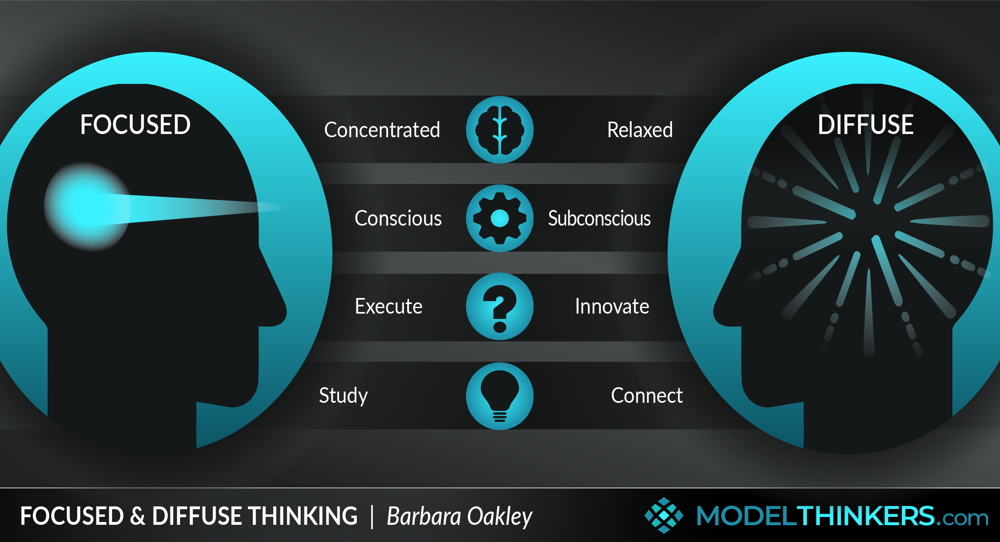

# Tarea lunes HTML5 17 de julio

## teórica

1. Observa el video [The power of believing that you can improve](https://www.ted.com/talks/carol_dweck_the_power_of_believing_that_you_can_improve), y comente que significa para usted creer que puede alcanzar una meta que desea.
2. Observa el video [Grit: The power of passion and perseverance](https://www.ted.com/talks/angela_lee_duckworth_grit_the_power_of_passion_and_perseverance), y comente que significa para usted la perseverancia según el video.
3. Observa el video y lee el articulo llamado [The learning myth: Why I'll never tell my son he's smart](https://www.khanacademy.org/college-careers-more/talks-and-interviews/talks-and-interviews-unit/conversations-with-sal/a/the-learning-myth-why-ill-never-tell-my-son-hes-smart), y comente que significa para usted que puede aprender cualquier cosa.
4. Diga que es el `Focus mode` y el `Diffuse mode` según el proceso de aprendizaje, diga sus diferencias y para que los usa nuestro cerebro.

El focused mode es cuando enfocamos nuestra atención en algo, por ejemplo cuando estamos haciendo deep work. Mientras que el diffuse mode entraría en acción cuando, sin pensar activamente, tu subconsciente trabaja en los problemas u asuntos que rondan por tu cabeza.

5. inscríbete en el programa llamado [Aprendiendo a aprender: herramientas mentales eficaces con las que podrás dominar temas difíciles](https://www.coursera.org/learn/learning-how-to-learn#syllabus), cumpla con sus asignaciones y obtenga el certificado finaliza en 4 semanas.

## Práctica

1. Realice el ejercicio `Time Conversion` del portal `HackerRank`.
2. agrega información al apartado de `about` de tu perfil de tu cuenta de usuario en el portal [LinkedIn](https://www.linkedin.com/), debe ser llenado en inglés.
3. Termine los retos plasmados en  los ejercicios del `1` al `91` de `Responsive Web Design`, del apartado `Learn Basic CSS by Building a Cafe Menu` del portal `freeCodeCamp`.
4. Realizar los ejercicios del portal o aplicativo `Duolingo` de la `sección 2` del idioma `inglés`.