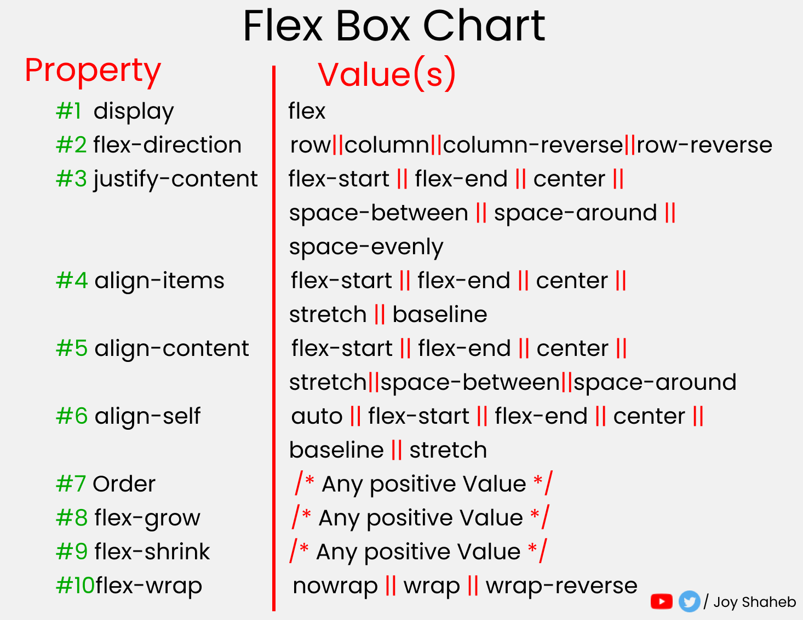

# Tarea Martes HTML5 01 de julio

## teórica

1. Lea el artículo [Text Editors](https://www.theodinproject.com/lessons/foundations-text-editors) y diga en clases que conclusiones puede tener del artículo.

El articulo habla de los editores de texto, como por ejemplo Microsoft Word y Libre-Office Writer, que son buenos para crear documentos pero no son aptos para escribir codigo. 

En cambio los editores de codigos si son aptos para ello, como por ejemplo: Visual Studio Code. 

Para instalar VSCode en nuestros sistema operativo Linux es necesario: 
1: Descargar VSCode 
: wget -O code-latest.deb 'https://code.visualstudio.com/sha/download?build=stable&os=linux-deb-x64'

2: Instalar VSCode
sudo apt install ./code-latest.deb

 3: Eliminar el archivo instalador
 rm code-latest.deb

 4: Usar VSCode
 code

2. Vea el video [VSCode Tutorial For Beginners - Getting Started With VSCode](https://www.youtube.com/watch?v=ORrELERGIHs&t=103s&ab_channel=TechWithTim) y diga en clases que conclusiones puede tener del video.

ANOTACIONES:
-CONTROL + ` para abrir terminal

| Introducción a VSCode 
| Apertura y creación de proyectos
| Explorador de archivos/proyectos
| VSCode Terminal
| Modo de pantalla completa
| Extensiones
| Buscar / Buscar y reemplazar
| Trucos y consejos del editor
| Cambio de preferencia de color/tema
| Buscador de archivos
| Configuración y tamaño de fuente
| Ejecución/ejecución de archivos
| Herramientas de Git/GitHub
| Depuración
| Modo Zen y otras características

3. Lea el artículo [VSCode docs](https://code.visualstudio.com/docs) y diga en clases que conclusiones puede tener del artículo.

El articulo habla sobre VSCode, que es editor de codigo fuente, muy conocido por ser de buena calidad y gratuito, compatible con Windows, macOS Y Linux. Tiene las siguientes caracteristicas: 
1 Finalización inteligente de código
2 Depuración optimizada 
3 Edición rápida y potente
4 Navegación y refactorización de código
5 Control de código fuente en el producto

 Ademas da algunas sugerencias al empezar en VSCode, como por ejemplo ver videos introductorios, investigar las herramientas de investigacion, investigar sobre la interfaz de usuario, descargar los soportes para el lenguaje a trabajar.

4. Lea el artículo [Introductory Videos](https://code.visualstudio.com/docs/getstarted/introvideos) y diga en clases que conclusiones puede tener del artículo.

El articulo habla sobre los videos introductorios que puedes encontrar en su pagina, como por ejemplo, el video introductorio getting started donde habla de los conceptos basicos de VSCode, code editingque habla de como editar y ejecutar codigos, el de productivity tips que da consejos de productividad , Personalize habla de como cambiar el tema de VSCode, extensions algunas extensiones que necesitan los lenguajes de programacion para hacer run and debug, debugging introduccion a la depuracion, version control ensena como usar el control de versiones de Git, customize ense;a como personalizar la configuracion.

5. Lea el artículo y vea el video [Getting started with Visual Studio Code](https://code.visualstudio.com/docs/introvideos/basics) y diga en clases que conclusiones puede tener del artículo.

El video habla un poco sobre VSCode, donde se encuentran las herramientas basicas, que se encuentra a la izquiera, donde esta la pestana de carpetas y archivos, la lupa para buscar algun archivo, el source control para controlar los cambios del codigo, tenemos run and debug y tenemos una pestana para las extensiones, ademas de ajustes y usuario.  

-Habla de la barra que esta abajo que nos indica los errores, el lenguaje de programacion usado, los espacios y notificaciones

-Menciona donde se encuentra la terminal, tambien como descargar una extension

6. Lea el artículo y vea el video [Code editing in Visual Studio Code](https://code.visualstudio.com/docs/introvideos/codeediting) y diga en clases que conclusiones puede tener del artículo.

Hbala sobre como editar un codigo, abres una carpeta, Instale el tiempo de ejecución .js Node para ejecutar código JavaScript, Instale el tiempo de ejecución .js Node para ejecutar código JavaScript,Crear nuevo archivo, Crea una variable string que diga "Hello World", crea una aplicacion de consola, Formatear automáticamente el código fuente.el comando Formato de documento (Mayús+Alt+F), Activa Guardar automáticamente en la parte de archivos, revise el terminal, ejecute el codigo y seleccione debug 

7. Lea el artículo y vea el video [Productivity Tips](https://code.visualstudio.com/docs/introvideos/productivity) y diga en clases que conclusiones puede tener del artículo.

El video habla sobre consejos para ser mas productivos:

 1 Paleta de comandos, que esta en view y te da basicamente un conjunto de atajos
 2 Control P te abre el buscador, tambien para buscar alguna linea en algun archivo o algun simbolo en algun archivo
 3 En file configuras el auto save 
 4 Para configurar opciones de apertura rapida 
 5 Intellisence te ayuda mucho a la hora de programar, con atajos que hacen que programar sea mas facil.

8. Lea el artículo y vea el video [Personalize Visual Studio Code](https://code.visualstudio.com/docs/introvideos/configure) y diga en clases que conclusiones puede tener del artículo.

-Cambia tu tema de color shift+contol+p para abrir el menu donde encontraras las opciones de temas para VSCode
-Instale un nuevo tema de color desde VS Code Extension Marketplace. sino encuentra el tema que le gusta, puede buscarlo en el instalador donde podras encontrar diferentes tipos
-Cambie el tema del icono de archivo, esto se hace descargando una extension de icons o buscando en la paleta de comandos  

9. Lea el artículo y vea el video [Using extensions in Visual Studio Code](https://code.visualstudio.com/docs/introvideos/extend) y diga en clases que conclusiones puede tener del artículo.

--Busque extensiones para instalar mediante la vista Extensiones.
-Instale una extensión desde VS Code -Extension Marketplace.
-Vea qué características se agregan a través de la pestaña Contribuciones de características o la Paleta de comandos (Ctrl + Mayús + P).
-Consulte las recomendaciones para otras extensiones

10. Lea el artículo y vea el video [Debugging in Visual Studio Code](https://code.visualstudio.com/docs/introvideos/debugging) y diga en clases que conclusiones puede tener del artículo.

PASOS
-Abrir una carpeta
-Tener Node.js
-Darle click al boton del lado izquierdo que sirve para ejecutar y depurar
otro metodo
Ejecute una aplicación Node.js de ejemplo.
Utilice un archivo de configuración.launch.json
Depuración de un solo archivo.
Establezca un punto de interrupción.

11. Lea el artículo y vea el video [Version control in VS Code](https://code.visualstudio.com/docs/introvideos/versioncontrol) y diga en clases que conclusiones puede tener del artículo.

-Instalar Git (https://git-scm.com)
-Abrir una carpeta
-Control de código fuente: View > Source Control (SCM) (Ctrl+Shift+G)
-Inicialice el repositorio
-Abra la paleta de comandos : View > Command Palette (Ctrl+Shift+P)
-Cambiar el nombre de una sucursal: Git: Rename Branch
-Estado del control de versiones de archivos
U - Archivo sin seguimiento
A - Archivo añadido
M - Archivo modificado
-Confirmar archivo: Commit ☑️(check mark) button
-Crear una rama: Git: Create Branch
-Editor de diferencias: Inline View button
-Cambios de etapa: Stage Changes ➕ button
-Cambios de etapa: Status bar branch item (lower left)
-Combinar rama: Views and More Actions (...) > Branch > Merge Branch
-Publicar rama en GitHub
-Clonar repositorio: Git: Clone > Clone from URL

12. Lea el artículo [Setting up Visual Studio Code](https://code.visualstudio.com/docs/setup/setup-overview) y diga en clases que conclusiones puede tener del artículo.

El articulo habla de Configuración de Visual Studio Code: 
-PARA ACTUALIZAR :  buscar actualizaciones manualmente ejecutando la Ayuda > Buscar actualizaciones en Linux y Windows o ejecutando Code > Buscar actualizaciones en macOS.

- para ver nuevas funciones con anticipación o verificar correcciones de errores, puedes instalar  Insiders build.

-Para obtener modo portatil Consulte la documentación del modo portátil de VS Code para obtener más información

-Configutre extensiones: Las extensiones de VS Code permiten a terceros agregar soporte para:

Lenguajes - C++, C#, Go, Java, Python
Herramientas - ESLint, JSHint , PowerShell
Depuradores - PHP XDebug.
Mapas clave - Vim, Sublime Text, IntelliJ, Emacs, Atom, Brackets, Visual Studio, Eclipse
13. Lea el artículo [User Interface](https://code.visualstudio.com/docs/getstarted/userinterface) y diga en clases que conclusiones puede tener del artículo.

14. Lea el artículo [User and Workspace Settings](https://code.visualstudio.com/docs/getstarted/settings) y diga en clases que conclusiones puede tener del artículo.

-Habla de la configuración del usuario y de la configuración del espacio de trabajo

-Para modificar la configuración del usuario, usará el editor de configuración para revisar y cambiar la configuración de VS Code. Para abrir el editor de Configuración, vaya a File > Preferences > Settings.

-La configuración del espacio de trabajo es específica de un proyecto y se puede compartir entre los desarrolladores de un proyecto. La configuración del espacio de trabajo anula la configuración del usuario.

-Puede editar a través de la pestaña Espacio de trabajo del editor de configuración o abrir esa pestaña directamente con el comando: Preferences: Open Workspace Settings

15. Lea el artículo [Programming Languages](https://code.visualstudio.com/docs/languages/overview) y diga en clases que conclusiones puede tener del artículo.

En conclusion en VSCode estan los siguientes lenguajes:  C++ - C# - CSS - Dart - Dockerfile - F# - Go - HTML - Java - JavaScript - JSON - Julia - Less - Markdown - PHP - PowerShell - Python - R - Ruby - Rust - SCSS - T-SQL - TypeScript.

Características del lenguaje en VS Code:
-Resaltado de sintaxis y coincidencia de corchetes
-Finalizaciones inteligentes (IntelliSense, -Inteligencia Artificial con GitHub Copilot)
-Forro y correcciones
-Navegación de código (Ir a Definición, -Buscar todas las referencias)
-Depuración
-Refactorización

16. Lea el artículo [Node.js tutorial in Visual Studio Code](https://code.visualstudio.com/docs/nodejs/nodejs-tutorial) y diga en clases que conclusiones puede tener del artículo.

17. Lea el artículo [Visual Studio Code Tips and Tricks](https://code.visualstudio.com/docs/getstarted/tips-and-tricks) y diga en clases que conclusiones puede tener del artículo.

- Instale Node.js para su plataforma. El Administrador de paquetes de nodos se incluye en la distribución Node.js. Deberá abrir un nuevo terminal (símbolo del sistema) para que las herramientas de línea de comandos estén en su PATH.nodenpm

-Agregue una variable de cadena simple ("Hola mundo") y, a continuación, envía el contenido de la cadena a la consola. Para ello, escribe lo siguiente en el archivo "app.js":

- Ejecutar el archivo "app.js" con Node.js. Abre el terminal en VS Code. Para ello, selecciona Ver>Terminal (o selecciona Ctrl+` mediante el carácter de tilde grave). Si necesitas cambiar el terminal predeterminado, selecciona el menú desplegable y elige Seleccionar el shell predeterminado.

-En el terminal, escribe: node app.js. Deberías ver la salida: "Hola mundo".

18. Lea el artículo [Azure Extensions](https://code.visualstudio.com/docs/azure/extensions) y diga en clases que conclusiones puede tener del artículo.

Extensiones de Azure: Azure Functions, Azure Machine Learning, Azure App Service, Azure CLI Tools, Azure Databases, Azure Resource Manager (ARM) Tools, Azure Storage, Azure Developer CLI

19. Lea el artículo [Extension API](https://code.visualstudio.com/api) y diga en clases que conclusiones puede tener del artículo.

El articulo habla de la extension API: 

Estos son algunos ejemplos de lo que puede lograr con la API de extensión:

-Cambiar el aspecto de VS Code con un tema de icono de color o archivo - Tematización
-Agregar componentes y vistas personalizados en la interfaz de usuario: ampliación del entorno de trabajo
-Crear una vista web para mostrar una página web personalizada creada con HTML/CSS/JS - Webview Guide
-Compatibilidad con un nuevo lenguaje de programación - Descripción general de las extensiones de lenguaje
-Compatibilidad con la depuración de un tiempo de ejecución específico - Guía de extensión del depurador

¿Cómo construir extensiones?

-Introducción enseña conceptos fundamentales para crear extensiones con el ejemplo Hello World.
-Capacidades de extensión disecciona la vasta API de VS Code en categorías más pequeñas y le dirige a temas más detallados.
-Guías de extensión incluye guías y ejemplos de código que explican los usos específicos de la API de extensión de código de VS.
-UX Guidelines muestra las mejores prácticas para proporcionar una excelente experiencia de usuario en una extensión.
-Language Extensions muestra cómo agregar compatibilidad para un lenguaje de programación con guías y ejemplos de código.
-Pruebas y publicación incluye guías detalladas sobre diversos temas de desarrollo de extensiones, como pruebas y publicaciones de extensiones.
-Temas avanzados explica conceptos avanzados como Host de extensión, Soporte de desarrollo remoto y espacios de código de GitHub, y API propuesta.
-Referencias contiene referencias exhaustivas para la API de VS Code, puntos de contribución y muchos otros temas.

20. Lea el artículo [Why did we build Visual Studio Code?](https://code.visualstudio.com/docs/editor/whyvscode) y diga en clases que conclusiones puede tener del artículo.

El articulo habla de lo facil que es usar VSCode para editar, compilar y depurar con facilidad, En esencia, Visual Studio Code presenta un editor de código fuente ultrarrápido, perfecto para el uso diario. Con soporte para cientos de idiomas, VS Code le ayuda a ser productivo al instante con resaltado de sintaxis, coincidencia de corchetes, sangría automática, selección de cuadros, fragmentos y más. Los métodos abreviados de teclado intuitivos, la fácil personalización y las asignaciones de métodos abreviados de teclado aportados por la comunidad le permiten navegar por su código con facilidad.

21. Lea el artículo [Key Bindings for Visual Studio Code](https://code.visualstudio.com/docs/getstarted/keybindings#_keymap-extensions) y diga en clases que conclusiones puede tener del artículo.

El articulo habla de las Extensiones de mapa de claves, las encuentras en  File > Preferences > Migrate Keyboard Shortcuts from.

las extensiones de mapa de claves son: Vim, sublime text keymap and settings importer, atom keymap, brackets keymap. 

22. Lea el artículo [Key Bindings for Visual Studio Code](https://code.visualstudio.com/docs/getstarted/keybindings#_keymap-extensions) y diga en clases que conclusiones puede tener del artículo. REPETIDO 

23. Lea el artículo [Visual Studio Code FAQ](https://code.visualstudio.com/docs/supporting/faq#_how-do-i-opt-out-of-vs-code-autoupdates) y diga en clases que conclusiones puede tener del artículo.

El articulo habla de algunas preguntas frecuentes que se dan, ejemplo 

-¿Cuál es la diferencia entre Visual Studio Code y Visual Studio IDE?
Visual Studio Code es un editor de código optimizado con soporte para operaciones de desarrollo como depuración, ejecución de tareas y control de versiones. Su objetivo es proporcionar solo las herramientas que un desarrollador necesita para un ciclo rápido de compilación-depuración de código y deja flujos de trabajo más complejos a IDE destacados más completos, como el IDE de Visual Studio.

-¿Qué sistemas operativos son compatibles?  macOS, Linux y Windows

-¿VS Code es gratis?
Sí, VS Code es gratuito para uso privado o comercial.

24. Lea el artículo [shortcuts for linux](https://go.microsoft.com/fwlink/?linkid=832144) y diga en clases que conclusiones puede tener del artículo.
Son los atajos de visual studio code 

## Práctica

1. Realice el ejercicio [Between Two Sets](https://www.hackerrank.com/challenges/between-two-sets/problem?isFullScreen=false) del portal [HackerRank](https://www.hackerrank.com/dashboard).

2. Haga los `ejercicios del 8 al 10` de los apartados de [c](https://www.hackerrank.com/domains/c), [c++](https://www.hackerrank.com/domains/cpp), [java](https://www.hackerrank.com/domains/java), [python](https://www.hackerrank.com/domains/python), [Ruby](https://www.hackerrank.com/domains/ruby), [SQL](https://www.hackerrank.com/domains/sql), [Linux shell](https://www.hackerrank.com/domains/shell), del portal [HackerRank](https://www.hackerrank.com/dashboard)
.
3. Crea tu resume haciendo uso de la [plantilla](https://docs.google.com/document/d/1jfUa4HGBDjt2peJPQ0Wg1YhdGkCoSysS6QMT4u8bCic/edit?usp=sharing).

4. Termine los retos plasmados en los ejercicios del `1` al `94` de `Responsive Web Design`, del apartado `Learn CSS Colors by Building a Set of Colored Markers` del portal `freeCodeCamp`.

5. Realizar los ejercicios del portal o aplicativo `Duolingo` de la `sección 9` del idioma `inglés`.
6. instale `VSCode` en el sistema operativo `Xubuntu`.