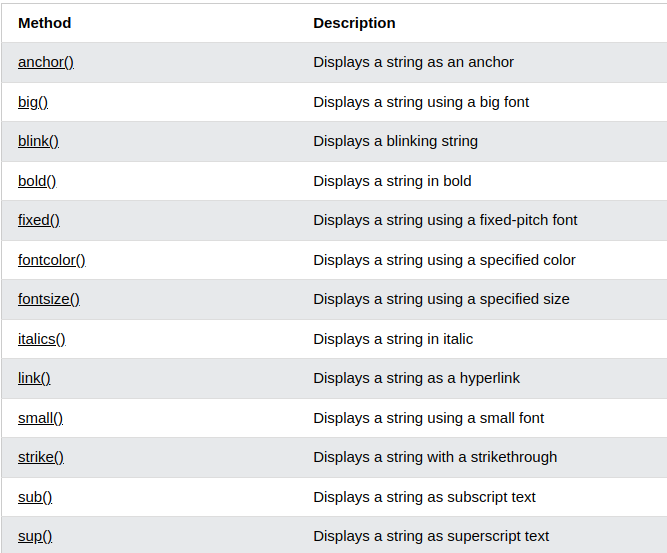
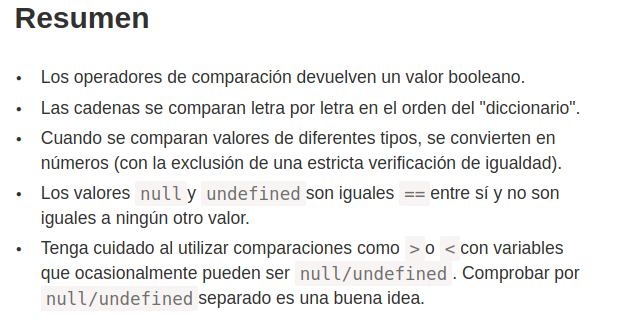

# Tarea Martes 05 de septiembre

## teórica

1. Lea el artículo [Fundamentals Part 2](https://www.theodinproject.com/lessons/foundations-fundamentals-part-2) y diga en clases que conclusiones puede tener del artículo.

Habla sobre lo basico de javascript

2. Lea el artículo [Introduction](https://www.theodinproject.com/lessons/foundations-fundamentals-part-2#introduction) y diga en clases que conclusiones puede tener del artículo.

Habla de que en el articulo se habla de lo mas comun que debemos saber sobre javascript

3. Lea el artículo [Lesson overview](https://www.theodinproject.com/lessons/foundations-fundamentals-part-2#lesson-overview) y diga en clases que conclusiones puede tener del artículo.

Nombra los ocho tipos de datos en JavaScript.
Comprenda la diferencia entre comillas simples, dobles y comillas invertidas.
Incrustar una variable/expresión en una cadena.
Entender qué es un método.
Nombra los tres operadores lógicos.
Comprenda qué son los operadores de comparación.
Entiende qué son los condicionales.
Entiende qué es el anidamiento.
Comprender qué son los valores verdaderos y falsos.

4. Lea el artículo [Handling text — strings in JavaScript](https://developer.mozilla.org/en-US/docs/Learn/JavaScript/First_steps/Strings) y diga en clases que conclusiones puede tener del artículo.

# HABLA DE:

- COMO DECLARAR CADENAS: 
const string = "The revolution will not be televised.";
console.log(string);

- COMILLAS SIMPLES, DOBLES E INVERTIDAS:
Las cadenas declaradas usando comillas simples y las cadenas declaradas usando comillas dobles son las mismas.
Las cadenas declaradas usando comillas invertidas son un tipo especial de cadena llamada literal de plantilla .

- INCRUSTAR JAVASCRIPT
Dentro de una plantilla literal, puede incluir variables o expresiones de JavaScript dentro ${ }y el resultado se incluirá en la cadena: 

  const name = "Chris";
  const greeting = `Hello, ${name}`;
  console.log(greeting); // "Hello, Chris"

- CONCATENACION EN CONTEXTO  ??

- INCLUIR ECPRESIONES EN CADENAS

  const song = "Fight the Youth";
  const score = 9;
  const highestScore = 10;
  const output = `I like the song ${song}. I gave it a score of ${
    (score / highestScore) * 100
  }%.`;
  console.log(output);

5. Lea el artículo [JavaScript String Methods](https://www.w3schools.com/js/js_string_methods.asp) y diga en clases que conclusiones puede tener del artículo.

HABLA DE LOS STRING:

1. JavaScript String Length
: La length propiedad devuelve la longitud de una cadena:

  let text = "ABCDEFGHIJKLMNOPQRSTUVWXYZ";
  let length = text.length;

2. JavaScript String slice(): slice() extrae una parte de una cadena y devuelve la parte extraída en una nueva cadena.

  let text = "Apple, Banana, Kiwi";
  let part = text.slice(7, 13);

3. JavaScript String substring(): substring() es similar a slice().

  let str = "Apple, Banana, Kiwi";
  let part = str.substring(7, 13);

4. JavaScript String substr():
substr() is similar to slice().
La diferencia es que el segundo parámetro especifica la longitud de la parte extraída.

  let str = "Apple, Banana, Kiwi";
  let part = str.substr(7, 6);

5. Replacing String Content:
El replace() método reemplaza un valor especificado con otro valor en una cadena:

  let text = "Please visit Microsoft!";
  let newText = text.replace("Microsoft", "W3Schools");

6. JavaScript String ReplaceAll(): En 2021, JavaScript introdujo el método de cadena replaceAll(), método le permite especificar una expresión regular en lugar de una cadena para reemplazar.

7. Converting to Upper and Lower Case: 
Una cadena se convierte a mayúsculas con toUpperCase():

Una cadena se convierte a minúsculas con toLowerCase():

8. JavaScript String concat(): concat()une dos o más cadenas: 
  let text1 = "Hello";
  let text2 = "World";
  let text3 = text1.concat(" ", text2);

9. JavaScript String trim():El trim()método elimina los espacios en blanco de ambos lados de una cadena:
  let text1 = "      Hello World!      ";
  let text2 = text1.trim()

10. JavaScript String trimStart()
El trimStart()método funciona como trim(), pero elimina los espacios en blanco solo desde el inicio de una cadena.
 
  let text1 = "     Hello World!     ";
  let text2 = text1.trimStart();
  
11. JavaScript String trimEnd()
El trimEnd()método funciona como trim(), pero elimina los espacios en blanco solo del final de una cadena.

12. JavaScript String padStart()
El padStart()método rellena una cadena desde el principio.

Rellena una cuerda con otra cuerda (varias veces) hasta que alcanza una longitud determinada.

13. JavaScript String padEnd()
El padEnd()método rellena una cadena desde el final.

Rellena una cuerda con otra cuerda (varias veces) hasta que alcanza una longitud determinada.

14. JavaScript String charAt()
El charAt()método devuelve el carácter en un índice (posición) especificado en una cadena:

15. JavaScript String charCodeAt()
El charCodeAt()método devuelve el Unicode del carácter en un índice especificado en una cadena:

El método devuelve un código UTF-16 (un número entero entre 0 y 65535).

16. String split() 
Una cadena se puede convertir en una matriz con el split()método:

6. Lea el artículo [JavaScript String Reference](https://www.w3schools.com/jsref/jsref_obj_string.asp) y diga en clases que conclusiones puede tener del artículo.

  Es como una sheetcheat

Métodos de cadena de JavaScript

Métodos de contenedor HTML de cadena

7. Lea el artículo [String](https://developer.mozilla.org/en-US/docs/Web/JavaScript/Reference/Global_Objects/String) y diga en clases que conclusiones puede tener del artículo.

Habla de como crear una cadena: const string1 = "A string primitive";

- Acceso a caracteres: 
  * "cat".charAt(1); // gives value "a"
  * "cat"[1]; // gives value "a"
  
- Comparando cadenas con un if y signos de comparacion

  const a = "a";
  const b = "b";
  if (a < b) {
    // true
    console.log(`${a} is less than ${b}`);
  } else if (a > b) {
    console.log(`${a} is greater than ${b}`);
  } else {
    console.log(`${a} and ${b} are equal.`);
  }

- String primitives and String objects: 

???????????????????????????????????????????????????????????????

8. Lea el artículo [Strings](https://www.theodinproject.com/lessons/foundations-fundamentals-part-2#strings) y diga en clases que conclusiones puede tener del artículo.

LO ANTERIOR 

9. Lea el artículo [Comparisons](https://javascript.info/comparison) y diga en clases que conclusiones puede tener del artículo.

Comparaciones
Conocemos muchos operadores de comparación de matemáticas.

En JavaScript están escritos así:

- Mayor/menor que: a > b, a < b.
- Mayor/menor que o igual: a >= b, a <= b.
- Igual a: a == b, tenga en cuenta que el signo de igualdad doble ==significa la prueba de igualdad, mientras que uno solo a = bsignifica una asignación.
- No es igual: en matemáticas la notación es ≠, pero en JavaScript se escribe como a != b.

* VALORES BOOLEANOS:

  - true– significa “sí”, “correcto” o “la verdad”.
  - false– significa “no”, “incorrecto” o “no es la verdad”.

* COMPARACION DE CADENAS 
  El algoritmo para comparar dos cadenas es simple:

  - Compare el primer carácter de ambas cadenas.
  - Si el primer carácter de la primera cadena es mayor (o menor) que el de la otra cadena, entonces la primera cadena es mayor (o menor) que la segunda. Hemos terminado.
  - De lo contrario, si los primeros caracteres de ambas cadenas son iguales, compare los segundos caracteres de la misma manera.
  - Repita hasta el final de cualquiera de las cuerdas.
  - Si ambas cuerdas terminan en la misma longitud, entonces son iguales. De lo contrario, la cuerda más larga es mayor.

10. Lea el artículo [JavaScript if, else, and else if](https://www.w3schools.com/js/js_if_else.asp) y diga en clases que conclusiones puede tener del artículo.

11. Lea el artículo [Logical operators](https://javascript.info/logical-operators) y diga en clases que conclusiones puede tener del artículo.

EL ARTICULO HABLA SOBRE DECLARACIONES CONDICIONALES:

- Úse ifpara especificar un bloque de código que se ejecutará, si una condición especificada es verdadera
- Úse elsepara especificar un bloque de código que se ejecutará, si la misma condición es falsa
- Úse else ifpara especificar una nueva condición para probar, si la primera condición es falsa
- Se utiliza switch para especificar muchos bloques alternativos de código que se ejecutarán.

12. Lea el artículo [Making decisions in your code — conditionals](https://developer.mozilla.org/en-US/docs/Learn/JavaScript/Building_blocks/conditionals) y diga en clases que conclusiones puede tener del artículo.

el articulo habla sobre los condicionales, 

- if...else statements 

- switch statements 
toman una sola expresión/valor como entrada y luego examinan varias opciones hasta encontrar una que coincida con ese valor, ejecutando el código correspondiente que la acompaña. EJEMPLO 

  switch (expression) {
  case choice1:
    // run this code
    break;

  case choice2:
    // run this code instead
    break;

  // include as many cases as you like

  default:
    // actually, just run this code
    break;
  }

- OPERADOR TERNARIO 

  El operador ternario o condicional es una pequeña parte de sintaxis que prueba una condición y devuelve un valor/expresión si lo es true, y otro si lo es false; esto puede ser útil en algunas situaciones y puede ocupar mucho menos código que un if...elsebloque.

13. Lea el artículo [Conditional branching: if, '?'](https://javascript.info/ifelse) y diga en clases que conclusiones puede tener del artículo.

Habla del condiciomnal if 

La if(...)declaración evalúa una condición entre paréntesis y, si el resultado es true, ejecuta un bloque de código.

EJEMPLO:

let year = prompt('In which year was ECMAScript-2015 specification published?', '');

if (year == 2015) alert( 'You are right!' );

- CONVERSION BULEANA 

La if (…)declaración evalúa la expresión entre paréntesis y convierte el resultado a booleano.

Recordemos las reglas de conversión del capítulo Conversiones de tipos :

- Un número 0, una cadena vacía "", null,, undefinedy NaNtodo se convierte en false. Por eso se les llama valores "falsos".
- Otros valores se vuelven true, por eso se les llama “verdad”. 

- NOTA: TAMBIEN SIRVE EL ELSE IF

14. Lea el artículo [The "switch" statement](https://javascript.info/switch) y diga en clases que conclusiones puede tener del artículo.

habla de switch que es para hacer casos 

Una switchdeclaración puede reemplazar varios ifcheques.

Proporciona una forma más descriptiva de comparar un valor con múltiples variantes.

EJEMPLO 

  switch(x) {
  case 'value1':  // if (x === 'value1')
    ...
    [break]

  case 'value2':  // if (x === 'value2')
    ...
    [break]

  default:
    ...
    [break]
  }

15. Lea el artículo [Conditionals](https://www.theodinproject.com/lessons/foundations-fundamentals-part-2#conditionals) y diga en clases que conclusiones puede tener del artículo.

LO ANTERIOR 

16. Lea el artículo [Conditionals](https://www.theodinproject.com/lessons/foundations-fundamentals-part-2#conditionals) y diga en clases que conclusiones puede tener del artículo.

repetido

17. Realiza todas las actividades de [Assignment](https://www.theodinproject.com/lessons/foundations-fundamentals-part-2#assignment) y diga en clases que conclusiones puede tener del artículo.

PENDIENTE PENDIENTE PENDIENTE

18. Responda las preguntas de [Knowledge check](https://www.theodinproject.com/lessons/foundations-fundamentals-part-2#knowledge-check) y diga en clases que conclusiones puede tener del artículo.

- ¿Cuáles son los ocho tipos de datos en JavaScript?

- Siete tipos de datos primitivos:
numberpara números de cualquier tipo:       
  * enteros o de punto flotante, los números enteros están limitados por .±(253-1)
  * bigintpara números enteros de longitud arbitraria.
  * stringpara cuerdas. Una cadena puede tener cero o más caracteres; no existe un tipo de carácter único independiente.
  * booleanpara true/ false.
  * nullpara valores desconocidos: un tipo independiente que tiene un único valor null.
  * undefinedpara valores no asignados: un tipo independiente que tiene un único valor undefined.
  * symbolpara identificadores únicos.
- Y un tipo de datos no primitivo:
  * objectpara estructuras de datos más complejas.

- ¿Qué tipo de datos NO es primitivo?

EL TIPO DE DATOS OBJECT

- ¿Cuál es la relación entre nulo e indefinido?

Que los dos valores son indefinidos o desconocidos

- ¿Cuál es la diferencia entre comillas simples, dobles y comillas invertidas para cadenas?

Las comillas dobles y simples cumplen la misma funcion, pero las invertidas son para caracteres especiales

- ¿Cuál es el término para unir cadenas-strings?

eso se llama concatenacion
Usando ${ }, colocar las dos cadenas en constantes y llamarlas con ${ }

- ¿Qué tipo de cita te permite incrustar variables/expresiones en una cadena?

Dentro de una plantilla literal, puede incluir variables o expresiones de JavaScript dentro ${ }y el resultado se incluirá en la cadena

- ¿Cómo se incrustan variables/expresiones en una cadena?
colocar las dos cadenas en constantes y reescribirlas ambas juntas o concatenarlas con ${ }

- ¿Cómo se utilizan caracteres de escape en una cadena?

Los caracteres de escape significan que les hacemos algo para asegurarnos de que sean reconocidos como texto, no como parte del código

En JavaScript, hacemos esto poniendo una barra invertida justo antes del carácter.

- ¿Cuál es la diferencia entre los métodos de cadena de slice/substring/substr string methods? 

* slice()extrae una parte de una cadena y devuelve la parte extraída en una nueva cadena.

* substring()es similar a slice().

La diferencia es que los valores iniciales y finales menores que 0 se tratan como 0 en substring().

* substr()es similar a slice().

La diferencia es que el segundo parámetro especifica la longitud de la parte extraída.

- ¿Cuáles son los tres operadores lógicos y qué representan?

OR AND Y NOT

- ¿Cuáles son los operadores de comparación?

>
<
>=
<=
==
!=

- ¿Qué son los valores verdaderos y falsos?
0 y 1

- ¿Cuáles son los valores falsos en JavaScript?
0 

- ¿Qué son los condicionales?
- if 
- else 
- else if
- switch

- ¿Cuál es la sintaxis de un condicional if/else?

if (condition) {
  /* code to run if condition is true */
} else {
  /* run some other code instead */
}

- ¿Cuál es la sintaxis de una declaración de switch?

switch (expression) {
  case choice1:
    // run this code
    break;

  case choice2:
    // run this code instead
    break;

  // include as many cases as you like

  default:
    // actually, just run this code
    break;
}

- ¿Cuál es la sintaxis de un operador ternario?

SERA?

        const greeting = isBirthday
          ? "Happy birthday Mrs. Smith — we hope you have a great day!"
          : "Good morning Mrs. Smith.";

- ¿Qué es anidar?

Es colocar elementos dentro de otro elemento 

19. Vea los videos de [The Net Ninja’s Regular Expressions Tutorial](https://www.youtube.com/playlist?list=PL4cUxeGkcC9g6m_6Sld9Q4jzqdqHd2HiD) y diga en clases que conclusiones puede tener del artículo.

20. Lea el artículo [When you should NOT use Regular Expressions?](https://softwareengineering.stackexchange.com/questions/113237/when-you-should-not-use-regular-expressions) y diga en clases que conclusiones puede tener del artículo.

21. Realiza todas las actividades de [Additional resources](https://www.theodinproject.com/lessons/foundations-fundamentals-part-2#additional-resources) y diga en clases que conclusiones puede tener del artículo.

## Práctica

1. Realice el ejercicio [Between Two Sets](https://www.hackerrank.com/challenges/between-two-sets/problem?isFullScreen=false) del portal [HackerRank](https://www.hackerrank.com/dashboard).
2. Haga los `ejercicios del 8 al 10` de los apartados de [c](https://www.hackerrank.com/domains/c), [c++](https://www.hackerrank.com/domains/cpp), [java](https://www.hackerrank.com/domains/java), [python](https://www.hackerrank.com/domains/python), [Ruby](https://www.hackerrank.com/domains/ruby), [SQL](https://www.hackerrank.com/domains/sql), [Linux shell](https://www.hackerrank.com/domains/shell), del portal [HackerRank](https://www.hackerrank.com/dashboard).
3. Crea tu resume haciendo uso de la [plantilla](https://docs.google.com/document/d/1jfUa4HGBDjt2peJPQ0Wg1YhdGkCoSysS6QMT4u8bCic/edit?usp=sharing).
4. Termine los retos plasmados en los ejercicios del `1` al `63` de [Responsive Web Design](https://www.freecodecamp.org/learn/2022/responsive-web-design/), del apartado `Learn HTML Forms by Building a Registration Form` del portal [freeCodeCamp](https://www.freecodecamp.org/learn/).
5. Realizar los ejercicios del portal o aplicativo [Duolingo](https://www.duolingo.com/learn) de la `sección 10` del idioma `inglés`.